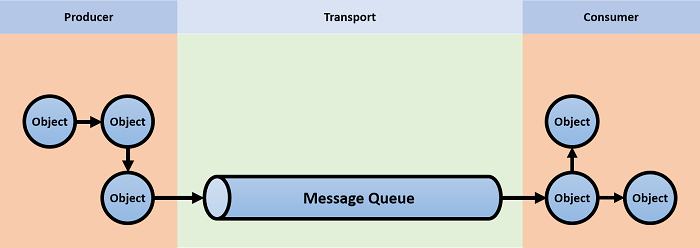
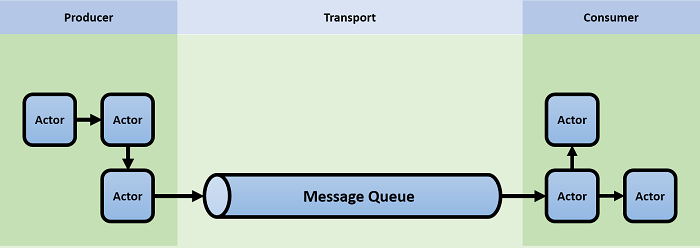
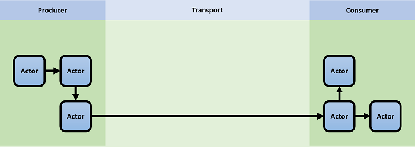

# Akka.NET and Message Queues

We get a lot of questions regarding Akka.NET and Message Queues.
What is the difference, when should you use what and how do they fit together.

First. let's take a brief look at how we traditionally have built distributed systems in .NET.

For a long time, frameworks like NServiceBus was the de-facto standard.
You would have some sort of producer that placed messages onto a message queue, and some sort of consumer that reads from the same message queue.

As we are in .NET land, you would probably use C# and object orientation to build your producer and consumer.

This will result in an architecture that looks somewhat like this:

This works, but it mixes two very different paradigms, synchronous methods and asynchronous messages.
Your producers and consumers will likely be largely synchronous due to how object orientation works.
You might also have a hard time to deal with concurrency internally as .NET lacks good support for this.
We have some tools to our disposal, e.g. Task Parallel Library which may help to some extent, but coordinating access to shared resources in your producers and consumers will be somewhat problematic.

A more transparent and aligned model would be to combine your message queue together with some sort of message and event based framework on both sending and receiving ends.

This is where Akka.NET comes in, as the Actor Model is based on asynchronous message passing, you can have the same mental model for the entire system.
Messages flows through your producer onto the message queue and into the consumer.
Now you have the full power of Akka.NET's concurrency model at your disposal, messages can be routed to different workers, you can limit access to shared resources and all of this is non blocking.

Thus, Akka.NET is a perfect fit for creating producers and consumers in your MQ based system.

The next step in evolving our system is to reason about the media that carries your messages from the producer to the consumer.

Is the message queue the right tool for the job?

Message queues are great tools, they often offer features like transactions, topics, future/delayed messages and at least once delivery semantics.

Are you using all of the features that your MQ offers? what is the cost of this in terms of throughput?

Maybe you just want to move a message as fast as you can from one system to another?
Or maybe you want guaranteed delivery but don't need all the other features?

In any such case, you could remove the MQ all together and simply use Akka.Remote possibly with the `GuaranteedDeliveryActor` that comes with Akka.Persistence.

This would allow your architecture to look something like this:

You now have a system built using fewer moving parts and less to configure.
But the real benefit here is that it allows for bi-directional communication and allows every actor  to communicate with any other actor in the system.

This is what is referred to as [Location Transparency](concepts/location-transparency.md),
distribution is no longer a construct that is bolted onto your system but rather built into the programming model itself.

You can also take this a lot further by introducing [Akka.Cluster](clustering/cluster-overview.md) to build truly scalable and elastic systems.

Do note that Akka.NET is in no way a complete replacement for message queues, message queues absolutely do have their place and enables scenarios that Akka.NET does not, e.g. integration wit other platforms. e.g. C# to Python etc.
